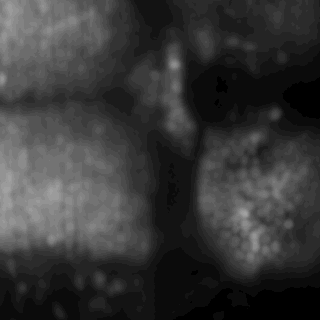

# Data processing
This is the data processing used for the calcium and voltage imaging

## Example -- whole-brain cell segmenation and zoom-in

## Environment setup
The dependent python packages are listed in `requirements.txt`, which should be all included in a major anaconda package.

Current parallel processing is based on Dask.

## Pipeline components
* Preprocessing of raw images -- Pixelwise denoising
* Image registration and motion correction
* Local SNMF for Cell segmentation

--------------------------
## Depreciated old repos
If you are looking for / using one of the following repos, these are merged to independent folder in the current one, and they are no longer developed or supported.
* denoiseLocalPCA
* spike-detection-voltron
* cmos-denoise
* single-cell rna seq
--------------------------
